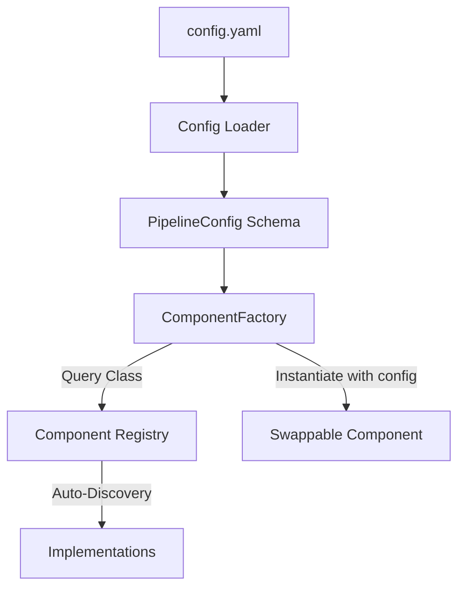
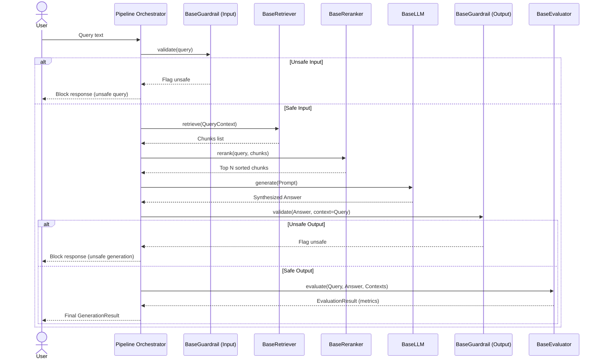

# Architecture & Design Guide

This guide details the design patterns, swappable interface layers, registry auto-discovery, and lifecycle execution flows within the Generic RAG Framework.

---

## 🗺️ High-Level System Architecture

The framework decouples component declarations from component instantiations. Components declare their contracts as Abstract Base Classes (ABCs), implement them in decoupled provider modules, and register themselves with a global registry. The orchestrator uses a factory to read configurations and instantiate components dynamically.



---

## 🔁 Pipeline Execution Flows

### 1. Ingestion Flow (Document indexing)

This flow handles parsing raw sources, splitting them into chunks, generating embeddings, and upserting vectors.


### 2. Retrieval & Generation Flow (User Querying)

This flow processes user inputs, performs semantic retrieval, reranks results, synthesizes answers, and validates safety/quality.



---

## 🏗️ Core Design Patterns

### 1. Component Registry Pattern

All swappable modules register themselves using decorators at import time. This keeps modules decoupled and avoids monolithic import blocks in the factory or main orchestrator.

The `ComponentRegistry` auto-discovery module imports every module in its registry list. Any optional modules missing third-party dependencies are skipped gracefully with standard warning logs, preventing startup failures.

```python
# Registration example in pgvector_store.py
@ComponentRegistry.register("vector_store", "pgvector")
class PGVectorStore(BaseVectorStore):
    ...
```

### 2. Factory Pattern & Dependency Injection

The `ComponentFactory` maps keys from the configuration models to resolved registry components. It acts as the dependency injector, ensuring that components are built with their appropriate nested settings.

```python
# The Factory dynamically gets class from registry and forwards config parameters
klass = ComponentRegistry.get(component_type, provider)
return klass(**config)
```

---

## 🧬 Pluggable Interface Layers

The framework defines 9 core interfaces, declared as Python Abstract Base Classes (ABCs) in [interfaces.py](../src/rag/core/interfaces.py).

| Interface            | Purpose                                                 | Standard Implementations                                                                  |
| :------------------- | :------------------------------------------------------ | :---------------------------------------------------------------------------------------- |
| `BaseParser`         | Extracts text and metadata from files/bytes.            | `UnstructuredParser`, `LlamaParseParser`                                                  |
| `BaseChunker`        | Splits documents into chunks with overlap.              | `SemanticChunker`, `RecursiveChunker`, `HierarchicalChunker`                              |
| `BaseEmbeddingModel` | Computes dense and sparse representation vectors.       | `OpenAIEmbeddings`, `CohereEmbeddings`, `LocalEmbeddings`                                 |
| `BaseLLM`            | Generates streaming, completion, or structured text.    | `OpenAILLM`, `AnthropicLLM`, `CohereLLM`, `LocalLLM`                                      |
| `BaseVectorStore`    | Initializes indexes, upserts chunks, and runs searches. | `QdrantStore`, `PineconeStore`, `MilvusStore`, `PGVectorStore`                            |
| `BaseRetriever`      | Coordinates retrieval strategies (e.g. multi-query).    | `SimpleRetriever`, `MultiQueryRetriever`, `AutoMergingRetriever`, `ContextualCompression` |
| `BaseReranker`       | Reranks candidate vectors using Cross-Encoders.         | `CohereReranker`, `CrossEncoderReranker`                                                  |
| `BaseGuardrail`      | Performs input/output content moderation checks.        | `LlamaGuard`, `NeMoGuardrails`                                                            |
| `BaseEvaluator`      | Runs automated RAG loop quality evaluations.            | `RagasEvaluator`, `TruLensEvaluator`                                                      |

---

## 🗄️ Swappable Document Registry Database Contract

To support database-driven document management (listing documents, filtering chunks, deleting files) across all vector store backends without leaking provider-specific client internals, the `BaseVectorStore` contract specifies three unified lifecycle methods:

1. **`list_chunks(limit: int = 10000) -> list[Chunk]`**
   * Scrolls/queries the vector index up to a limit and returns raw `Chunk` objects. Used by the API to dynamically compile the ingested document registry.
2. **`get_by_id(id: str) -> Chunk | None`**
   * Performs a point-lookup for a chunk by its primary key ID. Used to fetch parent chunks during Hierarchical Auto-Merging.
3. **`delete_by_metadata(key: str, value: Any) -> None`**
   * Deletes all vectors matching a specific metadata filter (such as `file_name = "report.pdf"`). Used to securely delete entire documents from the database.

These methods are fully implemented across all native storage providers:
* **Qdrant**: Employs `AsyncQdrantClient.scroll()`, `retrieve()`, and `delete()` filtering.
* **Pinecone**: Performs namespace-aware point lookups and metadata deletes.
* **Milvus**: Uses `query()` and `delete()` filters.
* **pgvector**: Executes native parameterized SQL queries on PostgreSQL tables.
* **SandboxDB**: Executes local sandbox scans inside FastAPI memory (Mock Mode).

---

## 🌲 Optimized Hierarchical Auto-Merging Retrieval

### The Parent Lookup Bug & Refactoring
In hierarchical chunking pipelines, child chunks represent small semantic windows while their parent chunks contain the broader paragraph context. When child hits exceed a set threshold, the retriever merges them into the parent chunk.

* **Before**: The retriever attempted to query parent chunks via a metadata filter (`filters={"id": parent_id}`). This failed on Qdrant, Pinecone, and pgvector because vector/row IDs are index-level primary keys and are not stored in payload dictionaries.
* **After**: The retriever utilizes the swappable `get_by_id(parent_id)` method. This executes a fast, index-native point-lookup by primary key across any active database provider, ensuring parent lookup succeeds reliably and quickly.
