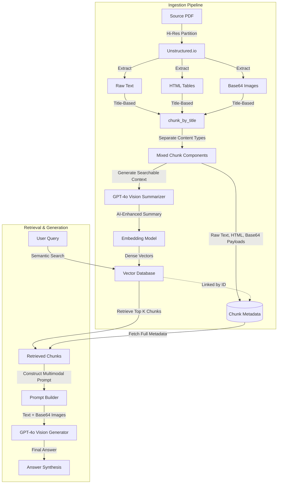

# Multi-Modal Retrieval-Augmented Generation (RAG) Guide

This guide describes how to implement and use the **Multi-Modal RAG pipeline** approach shown in the tutorial: **"Build a Multi-Modal RAG Pipeline That Actually Works (Unstructured.io)"**. 

In standard RAG, non-textual data like tables and images are either discarded or parsed into unstructured text, which leads to substantial information loss. This multi-modal pipeline architecture solves this by extracting, indexing, and generating answers directly from **text, structural tables (HTML), and images (Base64)** using **Unstructured.io** and **Vision LLMs** (e.g., GPT-4o).

---

## 🗺️ High-Level Multi-Modal RAG Architecture



---

## 🛠️ Prerequisites & Setup

Handling multi-modal documents with OCR and partition engines requires system-level dependencies. 

### 1. System Dependencies

Before running the Python code, install the required packages on your OS for handling OCR (Tesseract), PDF rendering (Poppler), and file-type detection (libmagic):

**Linux (Debian/Ubuntu):**
```bash
sudo apt-get update
sudo apt-get install -y poppler-utils tesseract-ocr libmagic-dev
```

**macOS:**
```bash
brew install poppler tesseract libmagic
```

### 2. Python Packages

Install the appropriate dependencies within your virtual environment:

```bash
pip install "unstructured[all-docs]>=0.23.0" langchain-chroma langchain-openai
```

---

## 🧪 Pipeline Implementation Steps

This section details how to integrate the multi-modal RAG approach into the existing Generic RAG Framework's decoupled component layout.

### Step 1: Implement the Multi-Modal Parser

We extend `BaseParser` to parse documents, retaining table HTML structure and extracting base64-encoded images.

Create a parser class, registered with the framework's Component Registry:

```python
# File: src/rag/ingestion/parsers/multimodal_unstructured.py
from __future__ import annotations

import asyncio
from pathlib import Path
from typing import Any

import structlog
from unstructured.partition.pdf import partition_pdf

from ...core.interfaces import BaseParser
from ...core.registry import ComponentRegistry
from ...core.types import Document, DocumentMetadata
from ...observability.tracing import trace_operation

logger = structlog.get_logger(__name__)

@ComponentRegistry.register("parser", "multimodal_unstructured")
class MultimodalUnstructuredParser(BaseParser):
    """Parses PDFs into elements preserving HTML tables and Base64 images."""

    def __init__(
        self,
        strategy: str = "hi_res",
        extract_images: bool = True,
        languages: list[str] | None = None,
    ) -> None:
        self._strategy = strategy
        self._extract_images = extract_images
        self._languages = languages or ["en"]

    async def parse(
        self,
        source: str | bytes,
        metadata: dict[str, Any] | None = None,
    ) -> list[Document]:
        """Partition PDF and extract text, tables, and base64-encoded images."""
        if not isinstance(source, str):
            raise NotImplementedError("Bytes source partition is not supported in hi_res parser.")
        
        loop = asyncio.get_running_loop()
        elements = await loop.run_in_executor(
            None, 
            self._partition, 
            source
        )

        # Convert Unstructured Elements into our standard Document schema
        # We group elements into chunks using Title-based clustering
        from unstructured.chunking.title import chunk_by_title
        chunks = chunk_by_title(
            elements,
            max_characters=3000,
            new_after_n_chars=2400,
            combine_text_under_n_chars=500
        )

        documents = []
        for i, chunk in enumerate(chunks):
            # Extract content types from original elements
            content_data = self._separate_content_types(chunk)
            
            # Format custom metadata to avoid vector DB serialization failures
            custom_metadata = {
                "raw_text": content_data["text"],
                "tables_html": content_data["tables"],
                "images_base64": content_data["images"],
                **(metadata or {})
            }

            doc_meta = DocumentMetadata(
                source=str(source),
                file_name=Path(source).name,
                file_type=Path(source).suffix.lstrip("."),
                language=self._languages[0],
                custom=custom_metadata
            )
            
            # Store raw text as main content for downstream compatibility
            documents.append(
                Document(
                    content=content_data["text"], 
                    metadata=doc_meta
                )
            )

        return documents

    def _partition(self, file_path: str) -> list[Any]:
        return partition_pdf(
            filename=file_path,
            strategy=self._strategy,
            infer_table_structure=True,
            extract_image_block_types=["Image"] if self._extract_images else [],
            extract_image_block_to_payload=True
        )

    def _separate_content_types(self, chunk: Any) -> dict[str, Any]:
        """Scan original elements grouped inside the chunk."""
        content_data = {
            "text": chunk.text,
            "tables": [],
            "images": []
        }
        if hasattr(chunk, "metadata") and hasattr(chunk.metadata, "orig_elements"):
            for element in chunk.metadata.orig_elements:
                el_type = type(element).__name__
                if el_type == "Table":
                    table_html = getattr(element.metadata, "text_as_html", element.text)
                    content_data["tables"].append(table_html)
                elif el_type == "Image":
                    if hasattr(element, "metadata") and hasattr(element.metadata, "image_base64"):
                        content_data["images"].append(element.metadata.image_base64)
        return content_data

    async def parse_batch(
        self,
        sources: list[str | bytes],
        metadata: list[dict[str, Any]] | None = None,
    ) -> list[Document]:
        tasks = []
        for i, source in enumerate(sources):
            meta = metadata[i] if metadata else None
            tasks.append(self.parse(source, meta))
        results = await asyncio.gather(*tasks, return_exceptions=True)
        
        flat_docs = []
        for res in results:
            if not isinstance(res, Exception):
                flat_docs.extend(res)
        return flat_docs
```

---

### Step 2: Implement the AI-Enhanced Chunker (Summarization)

Instead of generating embeddings directly on fragmented raw text, we use a Vision LLM to generate an **AI-Enhanced searchable description** of the mixed content (Text + Tables + Images). We embed this summary while keeping the raw payloads in metadata.

```python
# File: src/rag/ingestion/chunkers/multimodal_summarizer.py
from __future__ import annotations

from typing import Any
from langchain_core.messages import HumanMessage
from langchain_openai import ChatOpenAI

from ...core.interfaces import BaseChunker
from ...core.registry import ComponentRegistry
from ...core.types import Chunk, Document

@ComponentRegistry.register("chunker", "multimodal_summarizer")
class MultimodalSummarizerChunker(BaseChunker):
    """Generates AI-enhanced search descriptions for chunks containing tables and images."""

    def __init__(self, model_name: str = "gpt-4o", temperature: float = 0.0) -> None:
        self._llm = ChatOpenAI(model=model_name, temperature=temperature)

    async def chunk(self, document: Document) -> list[Chunk]:
        # Extract components from document custom metadata
        custom = document.metadata.custom
        raw_text = custom.get("raw_text", document.content)
        tables = custom.get("tables_html", [])
        images = custom.get("images_base64", [])

        # If it's pure text, skip LLM summarization to save tokens and time
        if not tables and not images:
            return [
                Chunk(
                    content=raw_text,
                    document_id=document.id,
                    metadata=document.metadata,
                    chunk_index=0
                )
            ]

        # Generate Multimodal Search Description
        prompt = f"""You are creating a searchable description for document content retrieval.

CONTENT TO ANALYZE:
TEXT CONTENT:
{raw_text}
"""
        if tables:
            prompt += "\nTABLES:\n"
            for idx, html in enumerate(tables):
                prompt += f"Table {idx+1}:\n{html}\n\n"

        prompt += """
YOUR TASK:
Generate a comprehensive, searchable description that covers:
1. Key facts, numbers, and data points from text and tables.
2. Main topics and concepts discussed.
3. Questions this content could answer.
4. Visual content analysis (charts, diagrams, patterns in images).
5. Alternative search terms users might use.

Make it detailed and searchable - prioritize findability over brevity.

SEARCHABLE DESCRIPTION:"""

        message_content: list[dict[str, Any]] = [{"type": "text", "text": prompt}]
        for base64_image in images:
            message_content.append({
                "type": "image_url",
                "image_url": {"url": f"data:image/jpeg;base64,{base64_image}"}
            })

        message = HumanMessage(content=message_content)
        
        # Async run LLM invocation
        response = await self._llm.ainvoke([message])
        enhanced_content = response.content

        # Create chunk using the AI-enhanced summary as searchable content
        return [
            Chunk(
                content=str(enhanced_content),
                document_id=document.id,
                metadata=document.metadata,
                chunk_index=0
            )
        ]

    async def chunk_batch(self, documents: list[Document]) -> list[Chunk]:
        tasks = [self.chunk(doc) for doc in documents]
        results = await asyncio.gather(*tasks)
        
        flat_chunks = []
        for i, chunks in enumerate(results):
            for chunk_idx, c in enumerate(chunks):
                c.chunk_index = chunk_idx
                flat_chunks.append(c)
        return flat_chunks
```

---

### Step 3: Implement Multi-Modal Answer Generation

When generating the final answer, retrieved search chunks are analyzed. For any document containing tables or images, we parse the raw fields out of `metadata.custom` and supply them to a Vision LLM along with the original question.

```python
# File: src/rag/llm/multimodal_generator.py
from typing import Any
import json
from langchain_core.messages import HumanMessage
from langchain_openai import ChatOpenAI
from ..core.types import RetrievalResult

class MultimodalAnswerGenerator:
    """Combines text, tables, and base64 images into a vision prompt for answer generation."""

    def __init__(self, model_name: str = "gpt-4o", temperature: float = 0.0) -> None:
        self._llm = ChatOpenAI(model=model_name, temperature=temperature)

    async def generate(self, query: str, retrieved_results: list[RetrievalResult]) -> str:
        # Build prompt containing text and tables
        prompt = f"""Based on the following documents, please answer this question: {query}

CONTENT TO ANALYZE:
"""
        images = []
        
        for idx, result in enumerate(retrieved_results):
            prompt += f"\n--- Document {idx+1} ---\n"
            custom = result.chunk.metadata.custom
            
            # Fetch raw text
            raw_text = custom.get("raw_text", result.chunk.content)
            prompt += f"TEXT:\n{raw_text}\n"
            
            # Fetch HTML tables
            tables = custom.get("tables_html", [])
            if tables:
                prompt += "\nTABLES:\n"
                for t_idx, table in enumerate(tables):
                    prompt += f"Table {t_idx+1}:\n{table}\n"
            
            # Accumulate images for multimodal payload
            images.extend(custom.get("images_base64", []))
            
        prompt += """
Please provide a clear, comprehensive answer using the text, tables, and images above. If the documents don't contain sufficient information to answer the question, say "I don't have enough information to answer that question based on the provided documents."

ANSWER:"""

        # Formulate multimodal messages
        message_content: list[dict[str, Any]] = [{"type": "text", "text": prompt}]
        for img in images:
            message_content.append({
                "type": "image_url",
                "image_url": {"url": f"data:image/jpeg;base64,{img}"}
            })

        message = HumanMessage(content=message_content)
        response = await self._llm.ainvoke([message])
        return str(response.content)
```

---

## ⚙️ Configuration Setup

Configure `config.yaml` to route your document ingestion through the registered `multimodal_unstructured` parser and the `multimodal_summarizer` chunker.

```yaml
# config.yaml
project:
  name: "multimodal-rag-pipeline"
  environment: "development"

ingestion:
  parser:
    provider: "multimodal_unstructured"
    config:
      strategy: "hi_res"
      extract_images: true
  chunker:
    provider: "multimodal_summarizer"
    config:
      model_name: "gpt-4o"
      temperature: 0.0
  batch_size: 10

embeddings:
  provider: "openai"
  config:
    model: "text-embedding-3-small"
    dimensions: 1538
    api_key: "${OPENAI_API_KEY}"

vector_store:
  provider: "qdrant"
  config:
    url: "http://localhost:6333"
    collection_name: "multimodal_kb"
```

---

## ⚙️ Run Ingestion and Querying

Use the pipeline orchestrator to execute the flow:

```python
import asyncio
from rag.config.loader import load_config
from rag.pipeline.orchestrator import RAGPipelineOrchestrator
from rag.llm.multimodal_generator import MultimodalAnswerGenerator

async def main():
    # 1. Load config and orchestrator
    config = load_config("config.yaml")
    orchestrator = RAGPipelineOrchestrator(config)
    
    # 2. Ingest document containing tables/images
    # This automatically partitions with hi_res, creates AI summaries,
    # and uploads the vectors to Qdrant.
    print("Ingesting PDF...")
    chunk_ids = await orchestrator.ingest_source("data/quarterly_report.pdf")
    print(f"Ingested {len(chunk_ids)} chunks into Vector DB.")

    # 3. Retrieve chunks
    # Simple retrieval uses orchestrator's retriever
    query_text = "What was the year-over-year growth rate shown in the charts and table?"
    print(f"Querying: {query_text}")
    
    # Perform retrieval & reranking
    q_ctx = orchestrator.retriever.retrieve(query_text)
    retrieved_results = await orchestrator.retriever.retrieve(q_ctx)
    
    if orchestrator.reranker:
        retrieved_results = await orchestrator.reranker.rerank(
            query=query_text, 
            results=retrieved_results, 
            top_n=3
        )

    # 4. Generate Answer using Multimodal synthesis
    generator = MultimodalAnswerGenerator(model_name="gpt-4o")
    answer = await generator.generate(query_text, retrieved_results)
    
    print("\n=== Multi-Modal RAG Answer ===")
    print(answer)

    # 5. Clean up
    await orchestrator.close()

if __name__ == "__main__":
    asyncio.run(main())
```

---

## 💡 Best Practices & Cost Optimization

> [!TIP]
> **Use OpenAI text-embedding-3-small for embeddings**
> AI-Enhanced summaries condense complex visual elements into dense, rich text summaries. You don't need a large embedding model to capture these; `text-embedding-3-small` is highly cost-effective and sufficient.

> [!WARNING]
> **Vision LLM Token Ingestion Costs**
> Parsing large PDFs with dozens of images and generating AI summaries via vision models (like GPT-4o) can consume significant input tokens. 
> To minimize costs:
> - Set `extract_images: false` for documents that do not contain charts or diagrams.
> - Parse document chunks sequentially and cache LLM responses where possible.
> - Clean up elements using `combine_text_under_n_chars` to group tiny text segments together before calling the vision summarizer.

> [!IMPORTANT]
> **Vector DB Metadata Limitations**
> Large Base64 image strings can bloat your vector database index size. 
> - If you are using a managed database service (like Pinecone or Qdrant Cloud), ensure that your plan has enough storage allocation.
> - Alternatively, consider uploading extracted images to an object store (like AWS S3 or Google Cloud Storage) during parsing, and saving the URLs in `metadata.custom` instead of storing raw Base64 data.
