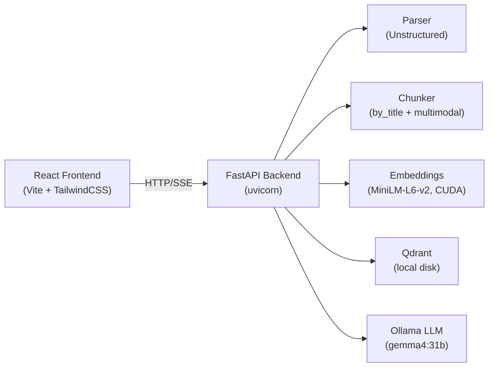

# 🚀 Performance Optimization Guide — Advanced RAG Application

After reviewing the full stack — FastAPI backend, RAG pipeline orchestrator, Qdrant vector store, local LLM/embeddings, and Vite React frontend — here are the highest-impact optimizations, ranked by **bang-for-buck**.

---

## Architecture Overview



---

## 🔴 Tier 1 — Critical Bottlenecks (Biggest Wins)

### 1. LLM Inference Is Your #1 Bottleneck

**Problem**: You're running `gemma4:31b-cloud` via Ollama locally. A 31B parameter model is the single largest latency contributor — likely **5–30 seconds per query** depending on GPU.

**Impact**: ⭐⭐⭐⭐⭐ | **Effort**: ⭐ (config change)

**Options (pick one):**

| Option | Expected Speedup | Trade-off |
|--------|------------------|-----------|
| Switch to a smaller model (`gemma3:12b`, `qwen3:8b`, `llama3.1:8b`) | 3–5× faster | Slightly lower quality |
| Use a quantized variant (`gemma4:31b-q4_K_M`) | 1.5–2× faster | Minimal quality loss |
| Offload to a cloud API (Gemini, GPT-4o-mini) | 5–10× faster | Cost, network dependency |
| Enable Ollama GPU layers (`OLLAMA_NUM_GPU_LAYERS`) | Up to 3× faster | Requires sufficient VRAM |

```yaml
# config.yaml — quick win: swap to a faster model
llm:
  config:
    base_url: http://localhost:11434/v1
    model: gemma3:12b        # ← 2-3× faster than 31b
    temperature: 0.1
  provider: local
```

> [!TIP]
> For query streaming (which you already support), perceived latency matters more than total latency. Smaller models produce first tokens faster, making the UI feel snappier.

---

### 2. Embedding Model — Use GPU Properly & Batch Smarter

**Problem**: Your [local_embeddings.py](file:///home/deemanth/repos/rough/advanced-rag/src/rag/embeddings/local_embeddings.py) is configured for `cuda` but `all-MiniLM-L6-v2` is tiny (22M params). The main issue is that `run_in_executor(None, ...)` uses the default thread pool (max 5 threads), creating a bottleneck under concurrent requests.

**Impact**: ⭐⭐⭐⭐ | **Effort**: ⭐⭐

**Fixes:**

#### a. Use a dedicated thread pool for embedding work
```python
# In local_embeddings.py — replace the default executor
import concurrent.futures

_EMBED_EXECUTOR = concurrent.futures.ThreadPoolExecutor(max_workers=2, thread_name_prefix="embed")

# In embed() and embed_query():
embeddings = await loop.run_in_executor(_EMBED_EXECUTOR, self._encode_sync, prefixed)
```

#### b. Pre-warm the model at startup instead of lazy loading
```python
# In orchestrator __init__, after creating embedding_model:
self.embedding_model._get_model()  # Force load at startup
```

#### c. Consider a faster embedding model for retrieval quality + speed

| Model | Dim | Speed | Quality |
|-------|-----|-------|---------|
| `all-MiniLM-L6-v2` (current) | 384 | Fast | Good |
| `BAAI/bge-small-en-v1.5` | 384 | Fast | Better |
| `nomic-ai/nomic-embed-text-v2-moe` | 768 | Fast | Excellent |

---

### 3. The `list_chunks(limit=10000)` Antipattern

**Problem**: Multiple API endpoints call `list_chunks(limit=10000)` to scroll the **entire** vector store and then filter/group in Python. This is called by:

- [GET /api/chunks](file:///home/deemanth/repos/rough/advanced-rag/src/rag/api/app.py#L508-L562) — loads everything
- [GET /api/documents](file:///home/deemanth/repos/rough/advanced-rag/src/rag/api/app.py#L806-L872) — loads everything, groups by filename
- [GET /api/documents/{filename}/chunks](file:///home/deemanth/repos/rough/advanced-rag/src/rag/api/app.py#L874-L934) — loads everything, filters by filename
- [Background summarizer](file:///home/deemanth/repos/rough/advanced-rag/src/rag/api/app.py#L29-L80) — loads everything every 15 seconds

**Impact**: ⭐⭐⭐⭐⭐ | **Effort**: ⭐⭐⭐

**Fixes:**

#### a. Add server-side filtering to `QdrantVectorStore`
```python
# Add to qdrant_store.py
async def list_chunks_by_metadata(self, key: str, value: Any, limit: int = 1000) -> list[Chunk]:
    """List chunks matching a specific metadata filter."""
    from qdrant_client.models import Filter, FieldCondition, MatchValue
    client = self._get_client()
    records, _ = await client.scroll(
        collection_name=self._collection_name,
        scroll_filter=Filter(must=[FieldCondition(key=key, match=MatchValue(value=value))]),
        limit=limit,
        with_payload=True,
        with_vectors=False,
    )
    # ... convert to chunks
```

#### b. Add pagination to `/api/chunks`
```python
@app.get("/api/chunks")
async def get_all_chunks(limit: int = 50, offset: int = 0):
    # Use Qdrant's native scroll with offset
```

#### c. Cache document grouping instead of recomputing on every request

---

## 🟡 Tier 2 — Significant Improvements

### 4. FastAPI/Uvicorn Tuning

**Problem**: [run_servers.sh](file:///home/deemanth/repos/rough/advanced-rag/run_servers.sh#L16) runs uvicorn with a single worker and no optimization flags.

**Impact**: ⭐⭐⭐ | **Effort**: ⭐

```bash
# Before (current):
.venv/bin/uvicorn src.rag.api.app:app --host 0.0.0.0 --port 8000

# After (optimized):
.venv/bin/uvicorn src.rag.api.app:app \
  --host 0.0.0.0 --port 8000 \
  --workers 1 \                  # Keep at 1 for shared GPU resources
  --loop uvloop \                # 2-4× faster event loop
  --http httptools \             # Faster HTTP parsing
  --timeout-keep-alive 30       # Reuse connections
```

> [!IMPORTANT]
> Install `uvloop` and `httptools`: `pip install uvloop httptools`
> With a local GPU model, stick with 1 worker to avoid GPU memory contention.

---

### 5. Ingestion Pipeline — Parallelize Parser + Chunker

**Problem**: In [orchestrator.py](file:///home/deemanth/repos/rough/advanced-rag/src/rag/pipeline/orchestrator.py#L363-L435), `_chunk_documents` separates standard vs multimodal docs but processes them sequentially. The multimodal summarizer calls the LLM one-by-one.

**Impact**: ⭐⭐⭐ | **Effort**: ⭐⭐

```python
# In multimodal_summarizer.py chunk_batch — already uses asyncio.gather ✓
# But the main orchestrator does standard then multimodal sequentially:

# BEFORE:
if standard_docs:
    chunks.extend(await self.chunker.chunk_batch(standard_docs))
if multimodal_docs:
    mm_chunks = await summarizer.chunk_batch(multimodal_docs)

# AFTER — run both in parallel:
tasks = []
if standard_docs:
    tasks.append(self.chunker.chunk_batch(standard_docs))
if multimodal_docs:
    tasks.append(summarizer.chunk_batch(multimodal_docs))
results = await asyncio.gather(*tasks)
for result in results:
    chunks.extend(result)
```

---

### 6. Qdrant — Use In-Memory Mode for Small Datasets

**Problem**: Your [config.yaml](file:///home/deemanth/repos/rough/advanced-rag/config.yaml#L72-L77) uses `url: data/qdrant_db` (disk-backed local Qdrant). For datasets under ~100K chunks, in-memory is significantly faster.

**Impact**: ⭐⭐⭐ | **Effort**: ⭐

```yaml
# config.yaml — for development/small datasets:
vector_store:
  config:
    collection_name: documents
    url: ":memory:"          # ← 5-10× faster reads
    vector_size: 384
  provider: qdrant
```

> [!WARNING]
> In-memory mode loses data on restart. Only use for development. For production with persistence, keep disk-backed but add `on_disk: false` for vectors to keep them in RAM with disk persistence.

---

### 7. Frontend — React Rendering Optimizations

**Problem**: The [ChunkInspector](file:///home/deemanth/repos/rough/advanced-rag/frontend/src/components/ingest/ChunkInspector.tsx) recomputes `getImages()`, `getTables()`, and `parseMarkdownTable()` on every render without memoization. With large base64 image payloads this is expensive.

**Impact**: ⭐⭐⭐ | **Effort**: ⭐⭐

```tsx
// Memoize expensive computations
import { useMemo } from 'react';

const imagesList = useMemo(() => getImages(), [selectedChunk]);
const tablesList = useMemo(() => getTables(), [selectedChunk]);
```

Also, the inline `<style>` tag at [line 137](file:///home/deemanth/repos/rough/advanced-rag/frontend/src/components/ingest/ChunkInspector.tsx#L137-L159) is re-injected on every render. Move it to a CSS file.

---

### 8. HTTP Client Connection Pooling

**Problem**: [LocalLLM](file:///home/deemanth/repos/rough/advanced-rag/src/rag/llm/local_llm.py#L67-L75) creates an `httpx.AsyncClient` with default pool settings. Under concurrent queries, this creates connection bottlenecks.

**Impact**: ⭐⭐ | **Effort**: ⭐

```python
# In local_llm.py _get_client():
self._client = httpx.AsyncClient(
    base_url=self._base_url,
    timeout=httpx.Timeout(self._timeout),
    headers={"Content-Type": "application/json"},
    limits=httpx.Limits(
        max_connections=20,
        max_keepalive_connections=10,
        keepalive_expiry=30,
    ),
)
```

---

## 🟢 Tier 3 — Polish & Production Readiness

### 9. Add Response Caching for Repeated Queries

```python
from functools import lru_cache
import hashlib

# Simple in-memory cache for query results
_query_cache: dict[str, GenerationResult] = {}

async def query(self, user_query: str, ...):
    cache_key = hashlib.sha256(user_query.encode()).hexdigest()
    if cache_key in _query_cache:
        return _query_cache[cache_key]
    # ... run pipeline ...
    _query_cache[cache_key] = result
    return result
```

### 10. Frontend Bundle Optimization

```typescript
// vite.config.ts — add code splitting and compression
import { defineConfig } from 'vite'
import react from '@vitejs/plugin-react'
import tailwindcss from '@tailwindcss/vite'

export default defineConfig({
  plugins: [react(), tailwindcss()],
  build: {
    rollupOptions: {
      output: {
        manualChunks: {
          vendor: ['react', 'react-dom'],
          markdown: ['react-markdown', 'remark-gfm'],
        },
      },
    },
    target: 'esnext',
    minify: 'esbuild',
  },
})
```

### 11. Reduce Background Summarizer Overhead

The [background summarizer](file:///home/deemanth/repos/rough/advanced-rag/src/rag/api/app.py#L29-L80) calls `list_chunks(limit=10000)` **twice** per cycle (once in the orchestrator method, once again to check for remaining missing). Refactor to return the count from `update_missing_summaries()`.

---

## Priority Execution Order

| # | Optimization | Impact | Effort | Where |
|---|-------------|--------|--------|-------|
| 1 | Swap to smaller/quantized LLM model | ⭐⭐⭐⭐⭐ | Config only | [config.yaml](file:///home/deemanth/repos/rough/advanced-rag/config.yaml#L39-L44) |
| 2 | Fix `list_chunks` antipattern with server-side filtering | ⭐⭐⭐⭐⭐ | Moderate | [app.py](file:///home/deemanth/repos/rough/advanced-rag/src/rag/api/app.py), [qdrant_store.py](file:///home/deemanth/repos/rough/advanced-rag/src/rag/vectorstores/qdrant_store.py) |
| 3 | Add `uvloop` + `httptools` to uvicorn | ⭐⭐⭐ | Trivial | [run_servers.sh](file:///home/deemanth/repos/rough/advanced-rag/run_servers.sh) |
| 4 | Pre-warm embedding model at startup | ⭐⭐⭐ | Trivial | [orchestrator.py](file:///home/deemanth/repos/rough/advanced-rag/src/rag/pipeline/orchestrator.py) |
| 5 | Parallelize standard + multimodal chunking | ⭐⭐⭐ | Easy | [orchestrator.py](file:///home/deemanth/repos/rough/advanced-rag/src/rag/pipeline/orchestrator.py#L363-L435) |
| 6 | Qdrant in-memory or RAM-cached vectors | ⭐⭐⭐ | Config only | [config.yaml](file:///home/deemanth/repos/rough/advanced-rag/config.yaml#L72-L77) |
| 7 | React `useMemo` for chunk inspector | ⭐⭐ | Easy | [ChunkInspector.tsx](file:///home/deemanth/repos/rough/advanced-rag/frontend/src/components/ingest/ChunkInspector.tsx) |
| 8 | HTTP connection pooling for LLM client | ⭐⭐ | Trivial | [local_llm.py](file:///home/deemanth/repos/rough/advanced-rag/src/rag/llm/local_llm.py#L67-L75) |

---

## Quick Wins You Can Do Right Now (< 5 minutes)

1. **Change `model: gemma3:12b`** in config.yaml → instant 2-3× query speedup
2. **Add `--loop uvloop --http httptools`** to uvicorn command
3. **Set `url: ":memory:"`** for Qdrant in development

Would you like me to implement any of these optimizations?
